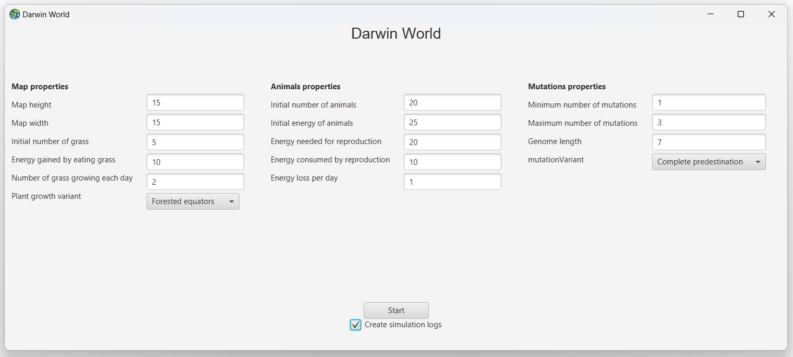
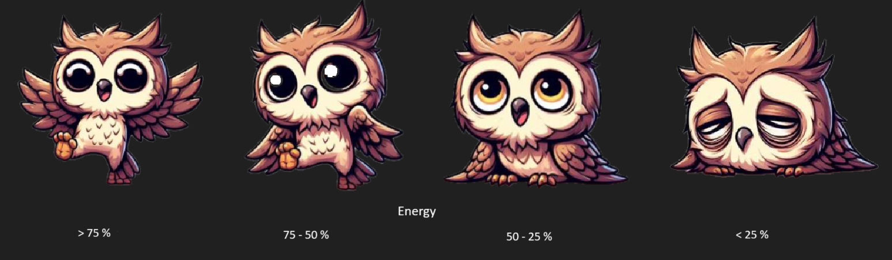
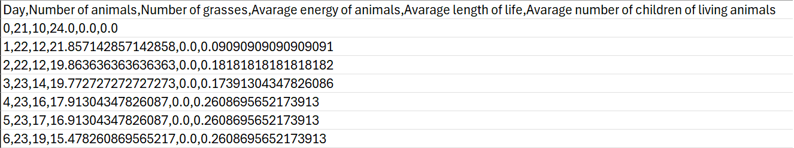

# Darwin World Simulator
## Simple simulator made for Object Oriented Programming course at AGH University (2023/2024)
### The project was done collaboratively with <a href="https://github.com/Karol0801">Karol0801</a>.

### Technologies
- Java
- JavaFX

### Introduction

The project involved writing a simulator of a world where evolution can be observed. Animals living in this world move, eat, and reproduce, passing on some of their genes to their offspring. When their energy drops to zero, they die.

Before starting the simulation, a series of parameters can be set in the main menu:

  

Every 0.25 seconds in the simulation represents one day, during which the animals move, eat (if they are standing on vegetation), and reproduce (if they are standing on the same field and have sufficient energy). The direction of movement on a given day depends on the currently active gene in the animal's genome, which changes after each movement. As a result of reproduction, a new animal appears, inheriting genes from its parents in appropriate proportions, followed by mutations. The simulation lasts for 1000 days or until the death of every animal.

During the simulation, the appearance of an animal may change due to variations in its energy level relative to the initial energy:

  

We can select one of two map variants:
* **forested equator - In the center of the map which is the equator, plants have a greater chance of growth than on the remaining fields of the map.**

  

* **poisonous fruits - There is a square area on the map where poisonous plants can grow (red ones).**

  

The program allows real-time tracking of certain simulation statistics. It is possible to run multiple simulations simultaneously, each in a separate thread (up to 4 simulations running simultaneously, with the rest waiting for their turn - mechanism handled using a thread pool). Before starting each simulation, we can select an option to generate simulation logs to a .csv file:

  

To check the details regarding the functionality of the project, click <a href="https://github.com/Soamid/obiektowe-lab/tree/master/proj">here</a>.
